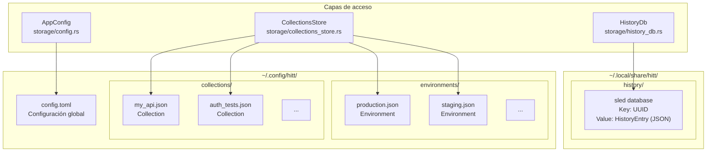

# Almacenamiento y persistencia

> Ver también: [ARCHITECTURE.md](./ARCHITECTURE.md) para la visión general.

hitt persiste su estado en tres ubicaciones del filesystem: configuración, colecciones y historial.

---

## Diagrama general



---

## AppConfig

**Archivo:** `~/.config/hitt/config.toml`
**Implementación:** `src/storage/config.rs`

### Campos

```rust
pub struct AppConfig {
    pub theme: ThemeName,              // Default: "catppuccin"
    pub default_environment: Option<String>,
    pub history_limit: usize,          // Default: 1000
    pub follow_redirects: bool,        // Default: true
    pub verify_ssl: bool,              // Default: true
    pub timeout_ms: u64,               // Default: 30_000 (30s)
    pub proxy: Option<String>,
    pub collections_dir: PathBuf,      // Default: ~/.config/hitt/collections
    pub editor: Option<String>,
    pub vim_mode: bool,                // Default: true
}
```

### Ejemplo de config.toml

```toml
theme = "dracula"
history_limit = 500
follow_redirects = true
verify_ssl = true
timeout_ms = 30000
vim_mode = true
```

### Ciclo de vida

1. **`load()`**: Lee `config.toml` desde disco. Si no existe, crea uno con valores por defecto y lo guarda.
2. **`validate()`**: Verifica que `timeout_ms > 0` y `history_limit > 0`.
3. **`save()`**: Serializa a TOML con pretty-printing y escribe al archivo.
4. **CLI overrides**: Los flags `--theme`, `--collection`, `--environment` sobreescriben valores en runtime.

### Modificación en runtime

El comando `:set` permite cambiar configuración sin editar el archivo:

```
:set timeout 5000
:set follow_redirects false
:set verify_ssl false
:set vim_mode true
:set history_limit 2000
:set theme gruvbox
```

---

## CollectionsStore

**Directorio:** `~/.config/hitt/collections/`
**Implementación:** `src/storage/collections_store.rs`

### Formato de archivo

Cada colección se guarda como un archivo JSON individual con pretty-printing:

```
~/.config/hitt/collections/
├── my_api.json
├── auth_tests.json
└── payment_service.json
```

### Operaciones

| Método | Descripción |
|--------|-------------|
| `load_all()` | Escanea el directorio recursivamente buscando `*.json`, deserializa cada uno como `Collection` |
| `load_collection(path)` | Carga una colección individual desde una ruta |
| `save_collection(collection)` | Guarda colección con nombre sanitizado como filename |
| `delete_collection(collection)` | Elimina el archivo de la colección |

### Environments

Los environments se guardan de forma similar en un subdirectorio:

```
~/.config/hitt/environments/
├── production.json
├── staging.json
└── development.json
```

| Método | Descripción |
|--------|-------------|
| `load_environments()` | Carga todos los archivos `*.json` del directorio de environments |
| `save_environment(env)` | Guarda environment con nombre sanitizado |

### Sanitización de nombres

Los nombres de archivo se sanitizan reemplazando caracteres no alfanuméricos (excepto `-` y `_`) con `_`:

```
"My API v2.0" → "My_API_v2_0.json"
"test/collection" → "test_collection.json"
```

---

## HistoryDb

**Directorio:** `~/.local/share/hitt/history/`
**Implementación:** `src/storage/history_db.rs`
**Motor:** [sled](https://github.com/spacejam/sled) — base de datos embebida key-value

### Modelo

```rust
pub struct HistoryEntry {
    pub id: Uuid,
    pub method: HttpMethod,
    pub url: String,
    pub status: Option<u16>,
    pub duration_ms: Option<u64>,
    pub size_bytes: Option<usize>,
    pub timestamp: DateTime<Utc>,
    pub collection_id: Option<Uuid>,
    pub request_id: Option<Uuid>,
    pub response_body: Option<String>,
    pub request_body: Option<String>,
}
```

### Almacenamiento

- **Key**: UUID del entry como string
- **Value**: `HistoryEntry` serializado a JSON bytes
- **Ordenamiento**: Por timestamp descendente (más reciente primero) al listar
- **Límite**: Configurable via `config.history_limit` (default: 1000)

### Operaciones

| Método | Descripción |
|--------|-------------|
| `open(path)` | Abre o crea la base de datos sled |
| `insert(entry)` | Inserta entry serializado como JSON |
| `get(id)` | Busca y deserializa un entry por UUID |
| `list(limit)` | Lista todos los entries ordenados por timestamp, truncado al límite |
| `clear()` | Elimina todos los entries |
| `count()` | Cuenta total de entries |

### Cuándo se escribe

Se agrega un `HistoryEntry` cada vez que se completa un request HTTP exitosamente (después de recibir la response).

---

## HistoryStore (in-memory)

Además de `HistoryDb` (persistente), existe `HistoryStore` en memoria para acceso rápido durante la sesión:

```rust
pub struct HistoryStore {
    entries: Vec<HistoryEntry>,
    max_entries: usize,
}
```

| Método | Descripción |
|--------|-------------|
| `add(entry)` | Agrega al inicio, trunca si excede `max_entries` |
| `entries()` | Retorna slice de entries |
| `search(query)` | Búsqueda por substring en URL y método |
| `get(id)` | Busca por UUID |
| `clear()` | Limpia todo |

---

## Rutas del filesystem

```rust
// Configuración
fn config_dir() -> PathBuf {
    dirs::config_dir().join("hitt")     // ~/.config/hitt/
}

fn config_file() -> PathBuf {
    config_dir().join("config.toml")    // ~/.config/hitt/config.toml
}

// Datos
fn data_dir() -> PathBuf {
    dirs::data_dir().join("hitt")       // ~/.local/share/hitt/
}

// Colecciones
collections_dir = config_dir().join("collections")
environments_dir = collections_dir.parent().join("environments")

// Historial
history_dir = data_dir().join("history")
```

### Plataformas

| Plataforma | config_dir | data_dir |
|-----------|-----------|---------|
| Linux | `~/.config/hitt/` | `~/.local/share/hitt/` |
| macOS | `~/Library/Application Support/hitt/` | `~/Library/Application Support/hitt/` |
| Windows | `%APPDATA%\hitt\` | `%APPDATA%\hitt\` |
