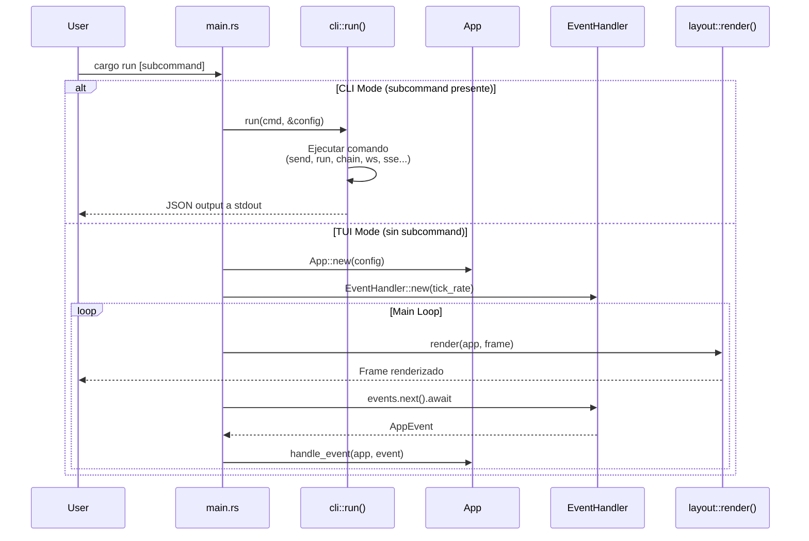
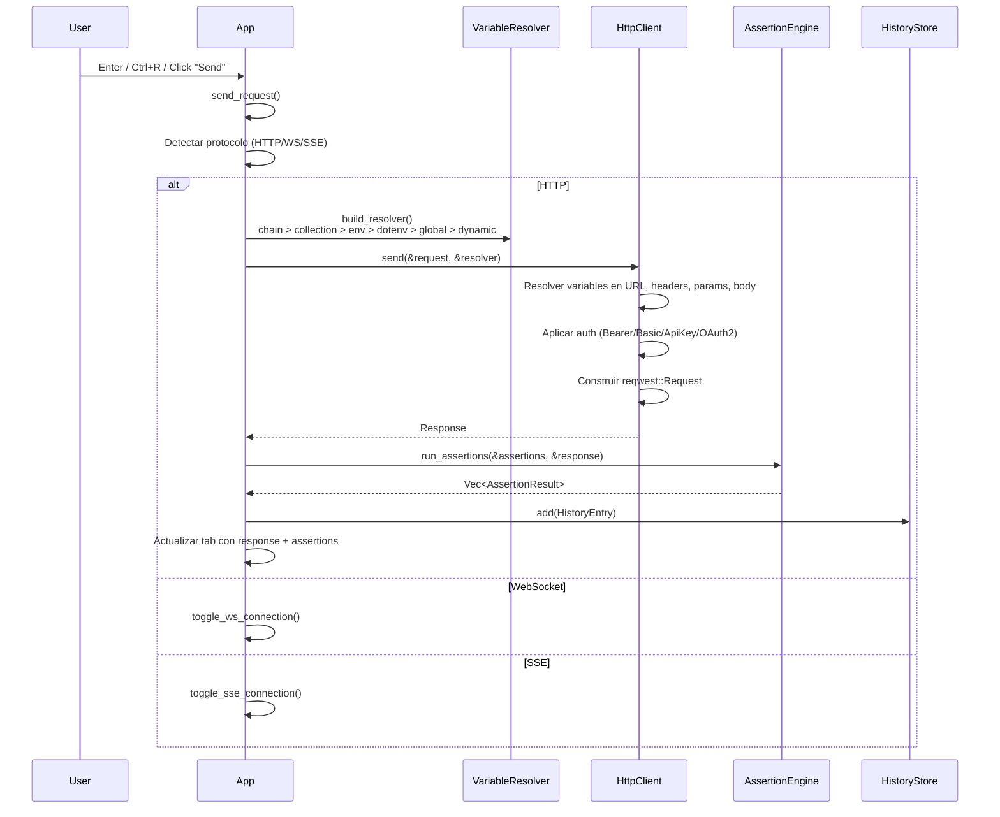
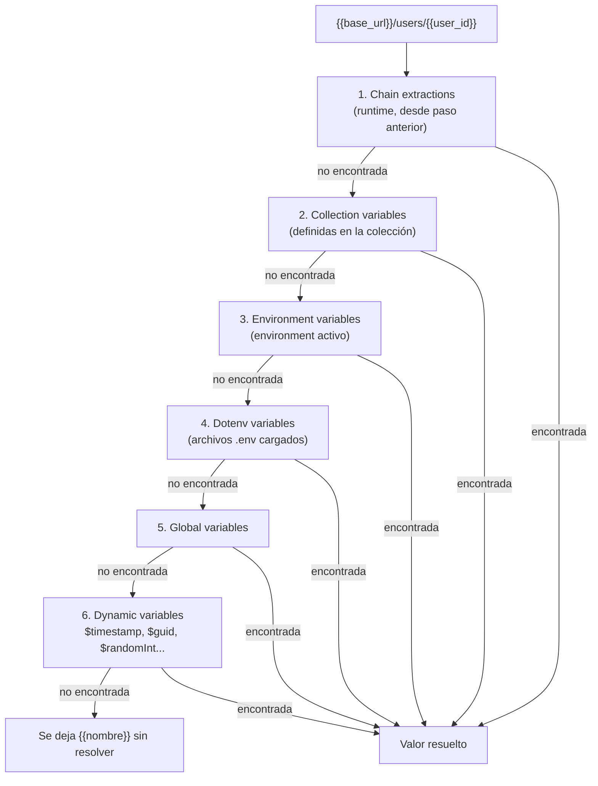
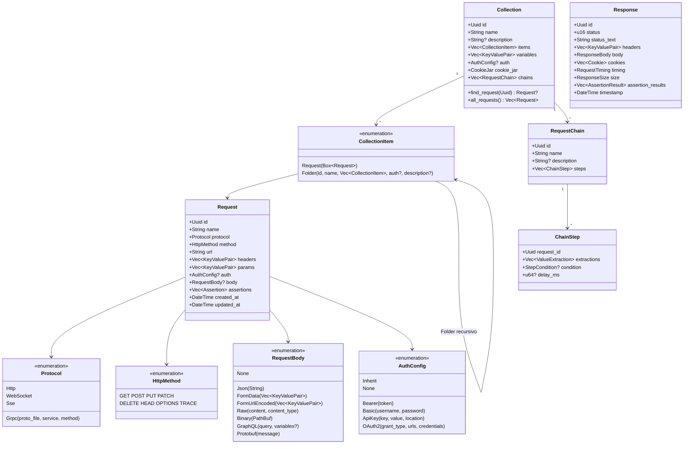

# Arquitectura de hitt

## Visión general

**hitt** es un cliente HTTP para terminal construido en Rust, diseñado como alternativa a Postman con interfaz TUI (Terminal User Interface). Soporta HTTP, WebSocket, SSE y gRPC, con colecciones, encadenamiento de requests, variables con scopes, aserciones y pruebas de carga.

### Stack tecnológico

| Dominio | Crate |
|---------|-------|
| TUI | `ratatui` 0.29, `crossterm` 0.28 |
| Async | `tokio` 1.x (full features) |
| HTTP | `reqwest` 0.12 (rustls, cookies, multipart) |
| WebSocket | `tokio-tungstenite` 0.24 |
| SSE | `reqwest-eventsource` 0.6 |
| gRPC | `tonic` 0.12, `prost` 0.13 |
| Serialización | `serde`, `serde_json`, `serde_yaml`, `toml` |
| JSON Queries | `jsonpath-rust` 0.7 |
| JSON Schema | `jsonschema` 0.26 |
| OpenAPI | `openapiv3` 2.x |
| Base de datos | `sled` 0.34 |
| CLI | `clap` 4.x (derive) |
| Errores | `thiserror` (dominio), `anyhow` (aplicación) |
| Diff | `similar` 2.x |
| Syntax highlight | `syntect` 5.x |
| Fuzzy search | `fuzzy-matcher` 0.3 |

---

## Mapa de módulos

```mermaid
graph TB
    main["main.rs<br/>Punto de entrada"]
    app["app.rs<br/>Estado central (App)"]
    cli["cli.rs<br/>Modo CLI"]
    lib["lib.rs<br/>Exports"]

    subgraph core["core/"]
        client["client.rs<br/>HttpClient"]
        request["request.rs<br/>Request, Protocol, HttpMethod"]
        response["response.rs<br/>Response, Timing"]
        collection["collection.rs<br/>Collection, CollectionItem"]
        variables["variables.rs<br/>VariableResolver"]
        chain["chain.rs<br/>RequestChain, ChainStep"]
        chain_exec["chain_executor.rs<br/>execute_chain()"]
        auth["auth.rs<br/>AuthConfig"]
        env["environment.rs<br/>Environment"]
        cookie["cookie_jar.rs<br/>CookieJar"]
        history["history.rs<br/>HistoryStore"]
        helpers["helpers.rs<br/>Utilidades"]
        constants["constants.rs<br/>Constantes"]
        error["error.rs<br/>HittError"]
    end

    subgraph event["event/"]
        event_mod["mod.rs<br/>AppEvent, EventHandler"]
        key_handlers["key_handlers.rs<br/>Normal mode"]
        insert_mode["insert_mode.rs<br/>Insert mode"]
        command_mode["command_mode.rs<br/>Command mode"]
        commands["commands.rs<br/>30+ comandos"]
        modal_handlers["modal_handlers.rs<br/>Modales"]
        mouse_handlers["mouse_handlers.rs<br/>Mouse"]
        navigation["navigation.rs<br/>Navegación"]
        sidebar_ev["sidebar.rs<br/>Sidebar"]
        chain_ev["chain.rs<br/>Chains"]
        protocols_ev["protocols.rs<br/>WS/SSE events"]
        persistence_ev["persistence.rs<br/>Guardar"]
        import_export_ev["import_export.rs<br/>Import/Export"]
    end

    subgraph ui["ui/"]
        layout["layout.rs<br/>render()"]
        theme["theme.rs<br/>Theme, Colors"]
        subgraph widgets["widgets/"]
            request_panel["request_panel.rs"]
            response_panel["response_panel.rs"]
            assertion_panel["assertion_panel.rs"]
            sidebar_w["sidebar.rs"]
            diff_viewer["diff_viewer.rs"]
            tab_bar["tab_bar.rs"]
            status_bar["status_bar.rs"]
            search_modal["search_modal.rs"]
            help_modal["help_modal.rs"]
            env_selector["env_selector.rs"]
        end
    end

    subgraph protocols["protocols/"]
        ws["websocket.rs<br/>Bridge task"]
        sse["sse.rs<br/>Bridge task"]
        grpc["grpc.rs<br/>Proto parsing"]
    end

    subgraph importers["importers/"]
        curl_imp["curl.rs"]
        openapi_imp["openapi.rs"]
        har_imp["har.rs"]
        chain_imp["chain.rs"]
        dotenv_imp["dotenv.rs"]
    end

    subgraph exporters["exporters/"]
        curl_exp["curl.rs"]
        markdown_exp["markdown_docs.rs"]
    end

    subgraph postman["postman/"]
        pm_import["import.rs"]
        pm_export["export.rs"]
        pm_env_imp["env_import.rs"]
        pm_env_exp["env_export.rs"]
        pm_schema["schema_v2_1.rs"]
    end

    subgraph storage["storage/"]
        config["config.rs<br/>AppConfig"]
        coll_store["collections_store.rs"]
        history_db["history_db.rs<br/>sled"]
    end

    subgraph testing["testing/"]
        assertions["assertion_engine.rs"]
        diff["diff.rs"]
        load_test["load_test.rs"]
        schema_val["schema_validator.rs"]
    end

    subgraph proxy["proxy/"]
        proxy_server["server.rs"]
        proxy_capture["capture.rs"]
        proxy_filter["filter.rs"]
    end

    main --> app
    main --> cli
    main --> event_mod
    main --> layout
    app --> core
    cli --> client
    cli --> chain_exec
    event_mod --> key_handlers
    event_mod --> mouse_handlers
    event_mod --> protocols_ev
    event_mod --> chain_ev
    layout --> widgets
    protocols_ev --> ws
    protocols_ev --> sse
    client --> request
    client --> response
    client --> variables
    client --> auth
    chain_exec --> client
    chain_exec --> chain
```



---

## Dos modos de ejecución

hitt tiene dos modos: **TUI** (interactivo) y **CLI** (scripting/CI).



### CLI: Subcomandos disponibles

| Comando | Descripción |
|---------|-------------|
| `send METHOD URL` | Enviar request ad-hoc |
| `run NAME` | Ejecutar request guardada |
| `collections` | Listar colecciones |
| `requests COLLECTION` | Listar requests de una colección |
| `create NAME METHOD URL` | Crear y guardar request |
| `chain run/list/create/import` | Operaciones con chains |
| `ws URL` | Conectar WebSocket |
| `sse URL` | Conectar SSE |

---

## Modelo de estado (App)

`App` es la struct central que contiene todo el estado de la aplicación. Se pasa como `&mut App` a los handlers de eventos y como `&App` a los widgets de UI.

### Campos principales

```rust
pub struct App {
    // Modos y navegación
    mode: AppMode,              // Modo actual de la app
    nav_mode: NavMode,          // Global (entre paneles) vs Panel (dentro)
    focus: FocusArea,           // Panel con foco actual
    last_right_focus: FocusArea, // Último panel derecho enfocado

    // Tabs de request
    tabs: Vec<RequestTab>,      // Cada tab tiene Request + Response + sesiones WS/SSE
    active_tab: usize,

    // Datos
    collections: Vec<Collection>,
    environments: Vec<Environment>,
    active_env: Option<usize>,
    history: HistoryStore,

    // Configuración
    config: AppConfig,
    theme: Theme,
    http_client: HttpClient,

    // Chains
    active_chain: Option<ChainExecutionState>,
    active_chain_def: Option<RequestChain>,

    // UI state
    sidebar_state: SidebarState,
    command_input: String,
    search_query: String,
    search_results: Vec<SearchResult>,
    notification: Option<Notification>,
    regions: ClickableRegions,  // Hit-testing para mouse
    loading: bool,
    should_quit: bool,

    // Comunicación async
    event_sender: Option<mpsc::UnboundedSender<AppEvent>>,
}
```

### AppMode — Máquina de estados

```mermaid
stateDiagram-v2
    [*] --> Normal
    Normal --> Insert: i (en campo editable)
    Normal --> Command: :
    Normal --> Modal: /, ?, Ctrl+I, Ctrl+X, etc.
    Normal --> ChainEditor: ejecutar chain
    Normal --> ProxyInspector: :proxy

    Insert --> Normal: Esc
    Command --> Normal: Esc / Enter
    Modal --> Normal: Esc / Enter
    ChainEditor --> Normal: Esc / q
    ProxyInspector --> Normal: Esc / q

    state Modal {
        Search
        Help
        EnvironmentEdit
        Import
        Export
        LoadTestConfig
        DiffSelector
        CurlImport
        RenameTab
        CollectionPicker
        RenameCollection
        RenameRequest
        Confirm
    }
```

### FocusArea — Layout de paneles

```
┌──────────────────────────────────────────────────┐
│                   Header / Tab Bar               │
├──────────┬───────────────────────────────────────┤
│          │  [UrlBar]  [Method] [Send]             │
│          ├───────────────────────────────────────┤
│          │  [RequestTabs] Params|Auth|Headers|... │
│ [Sidebar]│  [RequestBody]                        │
│          ├───────────────────────────────────────┤
│          │  [ResponseTabs] Body|Headers|Cookies|..│
│          │  [ResponseBody]                       │
├──────────┴───────────────────────────────────────┤
│                   Status Bar                      │
└──────────────────────────────────────────────────┘
```

**8 áreas de foco:** `Sidebar`, `UrlBar`, `RequestTabs`, `RequestBody`, `ResponseBody`, `ResponseTabs`, `ChainSteps`, `ProxyList`

### NavMode — Navegación

- **Global** (teclas: `h/j/k/l`): Mueve el foco entre paneles principales (Sidebar, UrlBar, RequestBody, ResponseBody)
- **Panel** (teclas: `h/j/k/l`): Navega dentro del panel actual (scroll, selección de items)
- `Enter` cambia de Global a Panel; `Esc` de Panel a Global

### RequestTab — Estado por tab

Cada tab es independiente con su propia request, response y sesiones de protocolo:

```rust
pub struct RequestTab {
    id: Uuid,
    request: Request,
    response: Option<Response>,
    request_tab: RequestTabKind,    // Params|Auth|Headers|Body|Assertions
    response_tab: ResponseTabKind,  // Body|Headers|Cookies|Timing|Assertions|WsMessages|SseEvents...
    collection_index: Option<usize>,
    dirty: bool,
    ws_session: Option<WebSocketSession>,
    sse_session: Option<SseSession>,
    ws_cmd_sender: Option<mpsc::UnboundedSender<WsCommand>>,
    sse_cmd_sender: Option<mpsc::UnboundedSender<SseCommand>>,
    ws_message_input: String,
    // ...
}
```

### ClickableRegions — Mouse hit-testing

Cada frame, el renderer actualiza `app.regions` con los `Rect` de cada elemento interactivo. Cuando llega un `MouseEvent`, `handle_mouse_click()` itera las regiones para determinar qué se clickeó.

---

## Flujo de una request HTTP



---

## Sistema de variables

Las variables usan la sintaxis `{{nombre}}` y se resuelven con una cadena de scopes de mayor a menor prioridad:



### Variables dinámicas

| Variable | Valor |
|----------|-------|
| `$timestamp` | Unix timestamp actual |
| `$isoTimestamp` | Timestamp ISO 8601 |
| `$guid` | UUID v4 |
| `$randomInt` | Entero aleatorio 0-999 |
| `$randomInt1000` | Entero aleatorio 0-999 |
| `$randomEmail` | Email aleatorio |
| `$randomFullName` | Nombre aleatorio |
| `$randomBoolean` | `true` o `false` |

### Optimización

`VariableResolver::resolve()` usa un fast path: si el string no contiene `{{`, se retorna directamente sin invocar regex.

---

## Modelo de datos del dominio



### Tipos de response

```rust
enum ResponseBody { Text, Json, Xml, Html, Binary, Empty }

struct RequestTiming {
    dns_lookup, tcp_connect, tls_handshake?,
    first_byte, content_download, total
}

struct ResponseSize { headers: usize, body: usize }
```

---

## Dependencias principales

| Dominio | Crate | Uso |
|---------|-------|-----|
| **TUI** | `ratatui` | Rendering de widgets y layout |
| **Terminal** | `crossterm` | Raw mode, mouse capture, eventos de teclado |
| **Editor** | `tui-textarea` | Widgets de input de texto |
| **Async** | `tokio` | Runtime async, spawn tasks, channels mpsc |
| **HTTP** | `reqwest` | Cliente HTTP con cookies, TLS, multipart |
| **WebSocket** | `tokio-tungstenite` | Protocolo WebSocket |
| **SSE** | `reqwest-eventsource` | Server-Sent Events |
| **gRPC** | `tonic`, `prost` | Cliente gRPC y serialización Protobuf |
| **JSON** | `serde_json` | Serialización/deserialización JSON |
| **YAML** | `serde_yaml` | Chains y OpenAPI |
| **TOML** | `toml` | Archivo de configuración |
| **JSONPath** | `jsonpath-rust` | Extracción de valores en aserciones y chains |
| **JSON Schema** | `jsonschema` | Validación de schemas en aserciones |
| **OpenAPI** | `openapiv3` | Parsing de especificaciones OpenAPI 3.x |
| **Base de datos** | `sled` | Key-value embebido para historial |
| **CLI** | `clap` | Parsing de argumentos CLI |
| **IDs** | `uuid` | Identificadores únicos v4 |
| **Tiempo** | `chrono` | Timestamps y fechas |
| **Regex** | `regex` | Expresiones regulares |
| **URLs** | `url` | Parsing de URLs |
| **Base64** | `base64` | Encoding/decoding Base64 |
| **Clipboard** | `arboard` | Acceso al portapapeles |
| **Directorios** | `dirs` | Rutas estándar del SO |
| **Fuzzy** | `fuzzy-matcher` | Búsqueda fuzzy de requests |
| **Shell** | `shell-words` | Parsing de comandos cURL |
| **Diff** | `similar` | Algoritmo de diff línea por línea |
| **Syntax** | `syntect` | Syntax highlighting para JSON |
| **Random** | `rand` | Generación de valores aleatorios |
| **Errores** | `thiserror`, `anyhow` | Manejo de errores tipado y genérico |
| **Logging** | `tracing` | Logging estructurado (a `/tmp/hitt.log`) |
