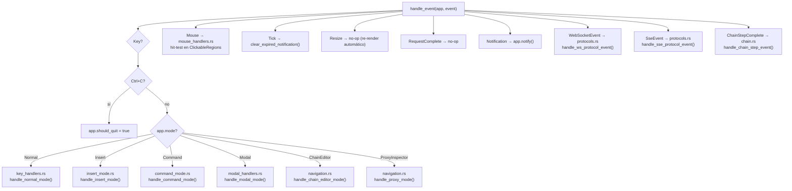

# Sistema de eventos

> Ver también: [ARCHITECTURE.md](./ARCHITECTURE.md) para el modelo de estado `App`.

## AppEvent enum

Todos los eventos del sistema fluyen a través de `AppEvent`. El `EventHandler` los produce y `handle_event()` los despacha.

```rust
pub enum AppEvent {
    Key(KeyEvent),                                    // Teclado (crossterm)
    Mouse(MouseEvent),                                // Mouse (crossterm)
    Tick,                                             // Timer periódico (100ms)
    Resize(u16, u16),                                 // Cambio de tamaño de ventana
    RequestComplete,                                  // Request HTTP completada
    Notification(String, NotificationKind),            // Notificación UI
    WebSocketEvent { session_id: Uuid, event: WsEventData },   // Evento WS
    SseEvent { session_id: Uuid, event: SseEventData },        // Evento SSE
    ChainStepComplete(ChainStepEvent),                // Paso de chain completado
}
```

### Subtipos de eventos de protocolo

```rust
enum WsEventData {
    Connected,
    Disconnected,
    MessageReceived(WsMessage),
    Error(String),
}

enum SseEventData {
    Connected,
    Disconnected,
    Event(SseEvent),
    Error(String),
}

enum ChainStepEvent {
    Running,
    Success,
    Failed,
    Skipped,
    Complete,
}
```

---

## EventHandler

Hilo OS dedicado que captura eventos de `crossterm` y los envía por un canal `mpsc` async.

```rust
pub struct EventHandler {
    rx: mpsc::UnboundedReceiver<AppEvent>,
    tx: mpsc::UnboundedSender<AppEvent>,
}
```

### Funcionamiento

1. **Hilo OS dedicado**: Usa `std::thread::spawn` para no bloquear el runtime de tokio
2. **Polling**: `crossterm::event::poll(tick_rate)` con intervalo de `TUI_TICK_RATE_MS` (100ms)
3. **Filtrado**: Descarta eventos de mouse ruidosos (`MouseEventKind::Moved`, `Drag`) para evitar re-renders innecesarios
4. **Canal async**: Los eventos se envían por `mpsc::UnboundedSender<AppEvent>` al loop principal

### Uso del sender

El sender se clona y se comparte con las bridge tasks de WebSocket/SSE para que puedan inyectar eventos al loop principal:

```rust
app.event_sender = Some(events.sender());
// Las bridge tasks usan event_sender.send(AppEvent::WebSocketEvent { ... })
```

---

## Dispatch por modo



---

## Módulos de handlers

| Archivo | Responsabilidad | Funciones principales |
|---------|----------------|----------------------|
| `key_handlers.rs` | Normal mode: navegación, acciones globales, atajos vim | `handle_normal_mode()` — 515 líneas, despacha según `FocusArea` y tecla |
| `insert_mode.rs` | Insert mode: edición de texto en URL bar y WS message | `handle_insert_mode()` — input de caracteres, backspace, enter para enviar |
| `command_mode.rs` | Command mode: input y ejecución de comandos `:` | `handle_command_mode()` — delegación a `execute_command()` |
| `commands.rs` | Paleta de comandos: 30+ comandos disponibles | `execute_command()` — parsing de comando y argumentos, 730 líneas |
| `modal_handlers.rs` | Manejo de modales: search, help, import, export, rename | `handle_modal_mode()` → despacho a handler específico por `ModalKind` |
| `mouse_handlers.rs` | Eventos de mouse: click y scroll con hit-testing | `handle_mouse_click()`, `handle_mouse_scroll()`, `hit_test()` |
| `navigation.rs` | Navegación direccional dentro de paneles | `handle_nav_down/up/left/right()`, chain editor mode, proxy mode |
| `sidebar.rs` | Estado del sidebar: expandir/colapsar, selección | `build_sidebar_items()`, `handle_sidebar_action()`, `flatten_sidebar_items()` |
| `chain.rs` | Ejecución de request chains | `start_chain_execution()`, `run_chain_task()`, `handle_chain_step_event()` |
| `protocols.rs` | Eventos de WebSocket y SSE | `handle_ws_protocol_event()`, `handle_sse_protocol_event()`, `cycle_protocol_method()` |
| `persistence.rs` | Guardar colecciones a disco | `save_all_collections()`, `remove_request_from_collection()` |
| `import_export.rs` | Auto-detección y ejecución de import/export | `execute_import()`, `execute_export()`, `execute_import_chain()` |

---

## Normal mode — Keybindings principales

### Navegación

| Tecla | Acción |
|-------|--------|
| `j` / `↓` | Abajo (contexto: scroll, selección, navegación) |
| `k` / `↑` | Arriba |
| `h` / `←` | Izquierda (contexto: tabs, sidebar collapse) |
| `l` / `→` | Derecha (contexto: tabs, sidebar expand) |
| `J` | Half-page scroll down |
| `K` | Half-page scroll up |
| `g` | Ir al inicio |
| `G` | Ir al final |
| `Tab` | Ciclar foco adelante entre paneles |
| `Shift+Tab` | Ciclar foco atrás |
| `Alt+h/j/k/l` | Navegación directa entre paneles |
| `Enter` | Global→Panel mode; en Panel: acción contextual |
| `Esc` | Panel→Global mode |

### Acciones

| Tecla | Acción |
|-------|--------|
| `Ctrl+R` | Enviar request |
| `i` | Entrar en insert mode |
| `:` | Entrar en command mode |
| `/`, `p`, `Ctrl+P` | Búsqueda fuzzy de requests |
| `?` | Ayuda |
| `e`, `Ctrl+E` | Ciclar environments |
| `t`, `Ctrl+N` | Nuevo tab |
| `w` | Cerrar tab |
| `n` / `b` | Siguiente / anterior tab |
| `Alt+1-9` | Tab directo por número |
| `s`, `Ctrl+S` | Guardar request |
| `y` | Copiar response |
| `d` | Diff selector |
| `m` | Ciclar método HTTP / protocolo |
| `1-5` | Cambiar sub-tab de request/response |
| `q` | Quit / desconectar protocolo |
| `Ctrl+I` | Import modal |
| `Ctrl+X` | Export modal |
| `x` | Eliminar request (en sidebar) |
| `r` | Renombrar (en sidebar) |
| `a` | Toggle SSE / agregar request |
| `F2` | Renombrar tab |

---

## Paleta de comandos

Accesible con `:` en normal mode. Los comandos disponibles:

### Generales

| Comando | Argumentos | Descripción |
|---------|-----------|-------------|
| `:q`, `:quit` | — | Salir de la aplicación |
| `:help` | — | Mostrar modal de ayuda |
| `:theme` | `<nombre>` | Cambiar tema (catppuccin, dracula, gruvbox, tokyo-night) |
| `:set` | `<key> <value>` | Configurar: `timeout`, `follow_redirects`, `verify_ssl`, `vim_mode`, `history_limit`, `theme` |

### Requests y colecciones

| Comando | Argumentos | Descripción |
|---------|-----------|-------------|
| `:save` | — | Guardar request actual |
| `:rename` | `<nombre>` | Renombrar request actual |
| `:delreq` | — | Eliminar request seleccionada |
| `:newcol` | `<nombre>` | Crear nueva colección |
| `:delcol` | `[nombre]` | Eliminar colección |
| `:curl` | — | Copiar request como cURL al clipboard |
| `:paste-curl` | — | Importar cURL del clipboard |

### Environments y variables

| Comando | Argumentos | Descripción |
|---------|-----------|-------------|
| `:env` | `<nombre>` | Cambiar environment activo |
| `:newenv` | `<nombre>` | Crear nuevo environment |
| `:dupenv` | `[nombre]` | Duplicar environment activo |
| `:env-file` | `<ruta>` | Cargar archivo .env |
| `:addvar` | `<key> <value>` | Agregar variable a la colección |

### Import / Export

| Comando | Argumentos | Descripción |
|---------|-----------|-------------|
| `:import` | `[ruta]` | Importar colección (auto-detecta formato) |
| `:export` | `[ruta]` | Exportar colección |
| `:docs` | — | Exportar documentación Markdown |

### Protocolos

| Comando | Argumentos | Descripción |
|---------|-----------|-------------|
| `:ws` | `<url>` | Conectar WebSocket |
| `:ws-disconnect` | — | Desconectar WebSocket |
| `:sse` | `<url>` | Conectar SSE |
| `:sse-disconnect` | — | Desconectar SSE |

### Chains

| Comando | Argumentos | Descripción |
|---------|-----------|-------------|
| `:chain` | `<nombre>` | Ejecutar chain |
| `:newchain` | `<nombre>` | Crear nueva chain |
| `:addstep` | `<request_name>` | Agregar step a chain |
| `:importchain` | `<ruta>` | Importar chain desde YAML |

### Testing

| Comando | Argumentos | Descripción |
|---------|-----------|-------------|
| `:loadtest` | `<total> <concurrency>` | Ejecutar prueba de carga |
| `:diff` | — | Abrir selector de diff |

### Otros

| Comando | Argumentos | Descripción |
|---------|-----------|-------------|
| `:proxy` | — | Abrir proxy inspector |
| `:clearhistory` | — | Limpiar historial de requests |
