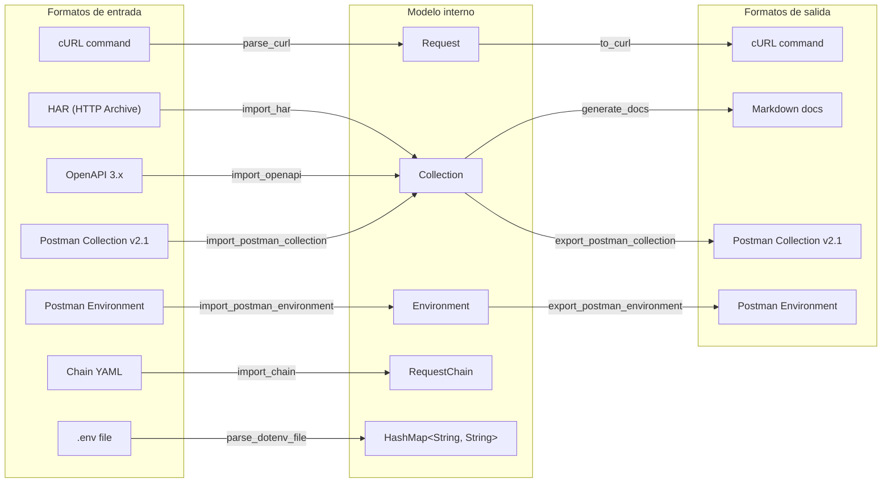

# Ecosistema de importadores y exportadores

> Ver también: [ARCHITECTURE.md](./ARCHITECTURE.md) para la visión general.

hitt puede importar y exportar en múltiples formatos para facilitar la interoperabilidad con otras herramientas.

---

## Diagrama general



---

## Importadores

### cURL → Request

**Archivo:** `src/importers/curl.rs`
**Función:** `parse_curl(input: &str) -> Result<Request>`

Parsea un comando cURL y lo convierte en un `Request`.

**Features del parser:**
- Continuación de línea (`\`)
- Shell word splitting con `shell-words`
- Flags soportados:
  - `-X`, `--request` → Método HTTP (default: GET, o POST si hay body)
  - `-H`, `--header` → Headers (parseados como `key: value`)
  - `-d`, `--data`, `--data-raw`, `--data-binary`, `--data-urlencode` → Body
  - `-F`, `--form` → Form data (multipart)
  - `-u`, `--user` → Basic auth (`username:password`)
- Auto-detección de Content-Type: JSON si el body comienza con `{` o `[`

**Ejemplo:**
```bash
curl -X POST https://api.example.com/users \
  -H "Authorization: Bearer token123" \
  -H "Content-Type: application/json" \
  -d '{"name": "John", "email": "john@example.com"}'
```

---

### HAR → Collection

**Archivo:** `src/importers/har.rs`
**Función:** `import_har(content: &str) -> Result<Collection>`

Importa un archivo HAR (HTTP Archive) exportado desde DevTools del navegador o proxies.

**Estructura HAR parseada:**
```rust
struct HarFile { log: HarLog }
struct HarLog { entries: Vec<HarEntry> }
struct HarEntry { request: HarRequest, response: Option<HarResponse> }
struct HarRequest { method, url, headers, queryString, postData }
struct HarPostData { mimeType, text, params }
```

**Conversión:**
- Cada `HarEntry` → `CollectionItem::Request`
- Filtra pseudo-headers y cookies
- Detecta tipo de body por MIME type
- Extrae query parameters
- Preserva headers de la request original

---

### OpenAPI 3.x → Collection

**Archivo:** `src/importers/openapi.rs`
**Función:** `import_openapi(content: &str) -> Result<Collection>`
**Crate:** `openapiv3` 2.x

Importa una especificación OpenAPI 3.0 (JSON o YAML) y genera una colección organizada.

**Proceso de conversión:**
1. Nombre de colección ← `info.title`
2. Variable `{{base_url}}` ← `servers[0].url`
3. Cada `path + operation` → `Request` con:
   - Nombre: operation ID o summary
   - URL: `{{base_url}}/path`
   - Query params del spec (marcados como required/optional)
   - Header params del spec
   - Body de ejemplo del `requestBody` schema
4. Agrupación: operaciones con tag → folder, sin tag → raíz

---

### .env → HashMap

**Archivo:** `src/importers/dotenv.rs`
**Función:** `parse_dotenv_file(path: &Path) -> Result<HashMap<String, String>>`

Parsea archivos `.env` con soporte para:

- Pares `KEY=VALUE`
- Prefijo `export` (ignorado)
- Strings con comillas simples y dobles
- Secuencias de escape en comillas dobles (`\n`, `\r`, `\t`)
- Comentarios (`#`)
- Líneas vacías

**Ejemplo:**
```env
# Database
DB_HOST=localhost
DB_PORT=5432
DB_PASSWORD="s3cr3t\nwith_newline"
export API_KEY='my-api-key'
```

---

### Chain YAML → RequestChain

**Archivo:** `src/importers/chain.rs`
**Función:** `import_chain(content: &str) -> Result<RequestChain>`

Importa una definición de cadena de requests desde YAML.

**Schema:**
```yaml
name: "User Registration Flow"
description: "Creates user, verifies email, gets profile"
steps:
  - request: "Create User"           # Nombre del request en la colección
    delay_ms: 500                     # Espera entre pasos (opcional)
    extract:                          # Extracciones (opcional)
      - source: body                  # body | header | status | cookie
        path: "$.data.user_id"        # JSONPath (para body)
        variable: "user_id"           # Nombre de variable
    condition:                        # Condición de ejecución (opcional)
      type: status_equals             # Tipo de condición
      value: 201                      # Valor esperado

  - request: "Verify Email"
    condition:
      type: variable_equals
      value: ["user_id", "expected_id"]

  - request: "Get User Profile"
    extract:
      - source: header
        path: "X-Request-Id"
        variable: "request_id"
```

**Tipos de condición:**
- `status_equals` → Ejecutar si status == valor
- `status_range` → Ejecutar si status en rango [min, max]
- `body_contains` → Ejecutar si body contiene substring
- `variable_equals` → Ejecutar si variable == valor esperado
- `always` → Ejecutar siempre

---

### Postman Collection v2.1 → Collection

**Archivo:** `src/postman/import.rs`
**Función:** `import_postman_collection(content: &str) -> Result<Collection>`

Convierte una colección Postman exportada (formato v2.1) al modelo interno.

**Mapeo:**
| Postman | hitt |
|---------|------|
| `info.name` | `Collection.name` |
| `info.description` | `Collection.description` |
| `variable[]` | `Collection.variables` |
| `item[]` (folder) | `CollectionItem::Folder` |
| `item[]` (request) | `CollectionItem::Request` |

**Auth mapping:**
| Postman auth type | hitt AuthConfig |
|-------------------|-----------------|
| `"bearer"` | `Bearer { token }` |
| `"basic"` | `Basic { username, password }` |
| `"apikey"` | `ApiKey { key, value, location }` |
| `"oauth2"` | `OAuth2 { grant_type, ... }` |

**Body mapping:**
| Postman body mode | hitt RequestBody |
|-------------------|------------------|
| `"raw"` + `"json"` | `Json(String)` |
| `"raw"` + `"text"` | `Raw { content, content_type }` |
| `"urlencoded"` | `FormUrlEncoded(Vec<KeyValuePair>)` |
| `"formdata"` | `FormData(Vec<KeyValuePair>)` |

---

### Postman Environment → Environment

**Archivo:** `src/postman/env_import.rs`
**Función:** `import_postman_environment(content: &str) -> Result<Environment>`

**Mapeo de variables:**
| Postman | hitt |
|---------|------|
| `type: "secret"` | `secret: true` |
| `type: "default"` | `secret: false` |
| `enabled: true/false` | `enabled: true/false` |

---

## Exportadores

### Request → cURL

**Archivo:** `src/exporters/curl.rs`
**Función:** `to_curl(request: &Request, resolver: &VariableResolver) -> String`

Genera un comando cURL con todas las variables resueltas.

**Incluye:**
- Método HTTP (omitido para GET)
- URL con query params resueltos
- Headers con valores resueltos
- Auth:
  - Bearer → `Authorization: Bearer {token}`
  - Basic → `-u username:password`
  - API Key → header o query param según ubicación
- Body con escaping para shell
- Auto-agrega `Content-Type: application/json` si no está presente

**Ejemplo de output:**
```bash
curl -X POST 'https://api.example.com/users?page=1' \
  -H 'Authorization: Bearer eyJhbGciOi...' \
  -H 'Content-Type: application/json' \
  -d '{"name":"John","email":"john@example.com"}'
```

---

### Collection → Markdown docs

**Archivo:** `src/exporters/markdown_docs.rs`
**Función:** `generate_docs(collection: &Collection) -> String`

Genera documentación Markdown de la API.

**Estructura del output:**
1. `# Collection Name` — Título y descripción
2. **Table of Contents** — Outline anidado de todos los requests
3. **Variables** — Tabla de variables de la colección
4. **Per-request sections**:
   - `## Request Name`
   - Método + URL
   - Descripción
   - Tabla de parámetros (nombre, requerido, descripción)
   - Body de ejemplo
   - Headers

---

### Collection → Postman Collection v2.1

**Archivo:** `src/postman/export.rs`
**Función:** `export_postman_collection(collection: &Collection) -> Result<String>`

Exporta al formato Postman v2.1 JSON:
- Preserva estructura de folders
- Mapea auth types de vuelta al formato Postman
- Convierte body types al modelo Postman
- Incluye schema version reference
- UUIDs como `_postman_id`

---

### Environment → Postman Environment

**Archivo:** `src/postman/env_export.rs`
**Función:** `export_postman_environment(env: &Environment) -> Result<String>`

- Variables secretas se exportan con valor vacío (por seguridad)
- Incluye metadata (id, name, scope)
- Type annotations para cada variable

---

## Auto-detección de formato

`src/event/import_export.rs` → `execute_import()` auto-detecta el formato:

| Extensión / contenido | Formato detectado |
|----------------------|-------------------|
| `.json` con `"info"` y `"item"` | Postman Collection |
| `.json` con `"values"` | Postman Environment |
| `.json` con `"log"` y `"entries"` | HAR |
| `.yaml` / `.yml` con `"openapi"` | OpenAPI |
| `.yaml` / `.yml` con `"steps"` | Chain YAML |
| `.env` | Dotenv |

El comando `:import [ruta]` y el flag `--import` usan esta auto-detección.
