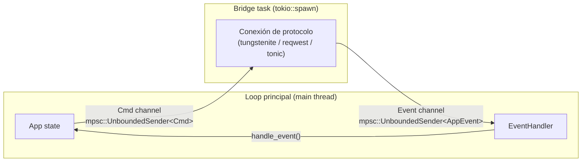
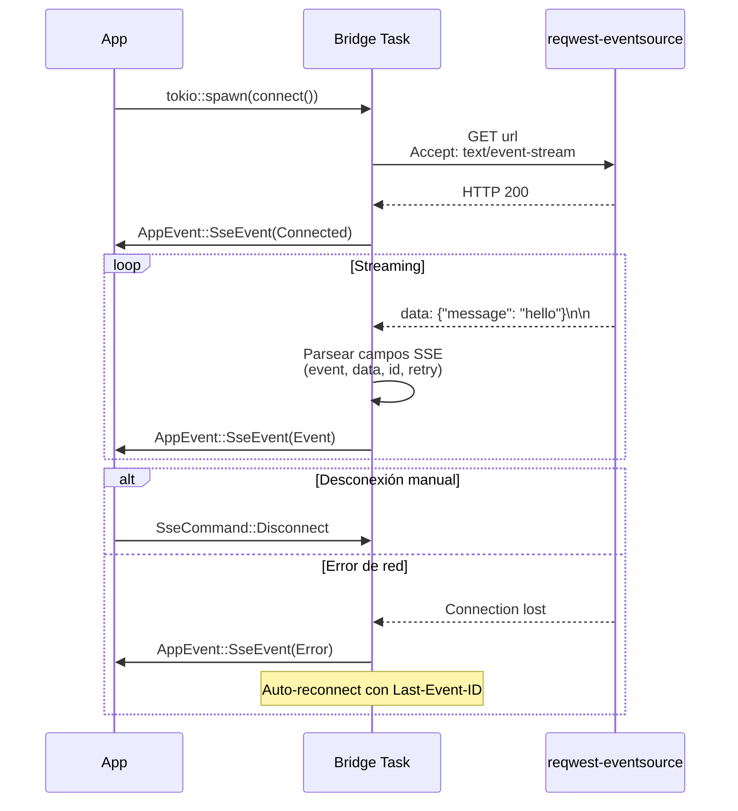

# Protocolos en tiempo real

> Ver también: [ARCHITECTURE.md](./ARCHITECTURE.md) para la visión general.

hitt soporta tres protocolos en tiempo real además de HTTP: **WebSocket**, **SSE** (Server-Sent Events) y **gRPC**. Los tres usan el mismo patrón arquitectónico para integrarse con el loop de eventos TUI.

---

## Patrón Bridge Task

Todos los protocolos en tiempo real usan el mismo patrón para comunicarse con el loop principal:



### Ciclo de vida

1. **Conexión**: `App` crea canales `mpsc` y hace `tokio::spawn` de la bridge task
2. **Comandos**: `App` envía comandos (Send, Disconnect) por el canal de comandos
3. **Eventos**: La bridge task envía eventos (Connected, Message, Error) como `AppEvent` al loop principal
4. **Desconexión**: Se cierra el canal de comandos, la task termina gracefully

### Almacenamiento por tab

Cada `RequestTab` almacena su propia sesión de protocolo:

```rust
pub struct RequestTab {
    // ...
    ws_session: Option<WebSocketSession>,
    sse_session: Option<SseSession>,
    ws_cmd_sender: Option<mpsc::UnboundedSender<WsCommand>>,
    sse_cmd_sender: Option<mpsc::UnboundedSender<SseCommand>>,
}
```

---

## WebSocket

Implementado en `src/protocols/websocket.rs` usando `tokio-tungstenite`.

### Modelo de datos

```rust
pub struct WebSocketSession {
    pub id: Uuid,
    pub url: String,
    pub status: WsStatus,
    pub messages: Vec<WsMessage>,
    pub headers: Vec<KeyValuePair>,
    pub auto_reconnect: bool,
    pub ping_interval: Option<Duration>,
}

pub enum WsStatus {
    Disconnected,
    Connecting,
    Connected { connected_at: DateTime<Utc> },
    Reconnecting { attempt: u32 },
    Error(String),
}

pub struct WsMessage {
    pub direction: MessageDirection,  // Sent | Received
    pub content: WsContent,           // Text(String) | Binary(Vec<u8>)
    pub timestamp: DateTime<Utc>,
}
```

### Comandos y eventos

```rust
pub enum WsCommand {
    Connect,
    Disconnect,
    SendText(String),
    SendBinary(Vec<u8>),
    Ping,
}

pub enum WsEvent {
    Connected,
    Disconnected,
    MessageReceived(WsMessage),
    Error(String),
}
```

### Flujo de conexión



```mermaid
sequenceDiagram
    participant App
    participant Task as Bridge Task
    participant WS as tokio-tungstenite

    App->>Task: tokio::spawn(connect())
    Task->>WS: connect_async(url)
    WS-->>Task: WebSocketStream
    Task->>App: AppEvent::WebSocketEvent(Connected)

    par Reader loop
        WS-->>Task: Message::Text/Binary
        Task->>App: AppEvent::WebSocketEvent(MessageReceived)
    and Writer loop
        App->>Task: WsCommand::SendText(msg)
        Task->>WS: send(Message::Text(msg))
    end

    App->>Task: WsCommand::Disconnect
    Task->>WS: close(CloseFrame)
    Task->>App: AppEvent::WebSocketEvent(Disconnected)
```

### Implementación

- Usa `stream.split()` para separar reader y writer en dos futures concurrentes
- El reader loop recibe mensajes del servidor y los inyecta como `AppEvent`
- El writer loop escucha el canal de comandos y envía mensajes al servidor
- Validación de URI antes de conectar
- Manejo graceful de close frames

### UI

- **Response tabs disponibles**: `WsMessages` (historial de mensajes), `WsInfo` (detalles de conexión)
- **Input bar**: Campo de texto para escribir mensajes, `Enter` para enviar
- **Normal mode**: `q` desconecta, `i` para entrar en insert mode y escribir mensajes

---

## SSE (Server-Sent Events)

Implementado en `src/protocols/sse.rs` usando `reqwest-eventsource`.

### Modelo de datos

```rust
pub struct SseSession {
    pub id: Uuid,
    pub url: String,
    pub status: SseStatus,
    pub events: Vec<SseEvent>,
    pub headers: Vec<KeyValuePair>,
    pub auto_reconnect: bool,
    pub accumulated_text: String,       // Stream completo acumulado
    pub last_event_id: Option<String>,  // Para reconexión
}

pub enum SseStatus {
    Disconnected,
    Connecting,
    Connected,
    Error(String),
}

pub struct SseEvent {
    pub event_type: Option<String>,
    pub data: String,
    pub id: Option<String>,
    pub timestamp: DateTime<Utc>,
}
```

### Comandos y eventos

```rust
pub enum SseCommand {
    Connect,
    Disconnect,
}

pub enum SseOutput {
    Connected,
    Event(SseEvent),
    Error(String),
    Disconnected,
}
```

### Flujo de conexión



### Parsing SSE

El parser implementa el [estándar SSE](https://html.spec.whatwg.org/multipage/server-sent-events.html):

- Separa eventos por doble newline (`\n\n` o `\r\n\r\n`)
- Extrae campos: `event:`, `data:` (multiline), `id:`, `retry:`
- Ignora líneas de comentario (`:`)
- Acumula chunks de streaming en buffer antes de parsear

### UI

- **Response tabs disponibles**: `SseEvents` (lista de eventos), `SseStream` (texto acumulado), `SseInfo` (detalles)
- **Toggle**: `a` para conectar/desconectar, o `:sse <url>` / `:sse-disconnect`

---

## gRPC

Implementado en `src/protocols/grpc.rs` usando `tonic` y `prost`.

### Modelo de datos

```rust
pub struct GrpcSession {
    pub id: Uuid,
    pub url: String,
    pub proto_file: Option<String>,
    pub services: Vec<GrpcService>,
    pub selected_service: Option<usize>,
    pub selected_method: Option<usize>,
    pub request_body: String,
    pub response_body: Option<String>,
    pub status: GrpcStatus,
}

pub enum GrpcStatus {
    Idle,
    Loading,
    Ready,
    Sending,
    Error(String),
}

pub struct GrpcService {
    pub name: String,
    pub methods: Vec<GrpcMethod>,
}

pub struct GrpcMethod {
    pub name: String,
    pub input_type: String,
    pub output_type: String,
    pub client_streaming: bool,
    pub server_streaming: bool,
}
```

### Tipos de método

```rust
impl GrpcMethod {
    pub fn method_type(&self) -> &'static str {
        match (self.client_streaming, self.server_streaming) {
            (false, false) => "Unary",
            (false, true)  => "Server Streaming",
            (true, false)  => "Client Streaming",
            (true, true)   => "Bidirectional Streaming",
        }
    }
}
```

### Proto file parsing

El módulo incluye un parser regex-based para archivos `.proto`:

1. Extrae bloques `service { ... }`
2. Dentro de cada servicio, extrae declaraciones `rpc MethodName(InputType) returns (OutputType)`
3. Detecta annotations `stream` para streaming methods
4. Retorna `Vec<GrpcService>` con metadata completa

### Protocolo en Request

```rust
pub enum Protocol {
    Http,
    WebSocket,
    Sse,
    Grpc {
        proto_file: PathBuf,
        service: String,
        method: String,
    },
}
```

El protocolo gRPC requiere especificar el archivo proto, servicio y método como parte de la definición del request.
